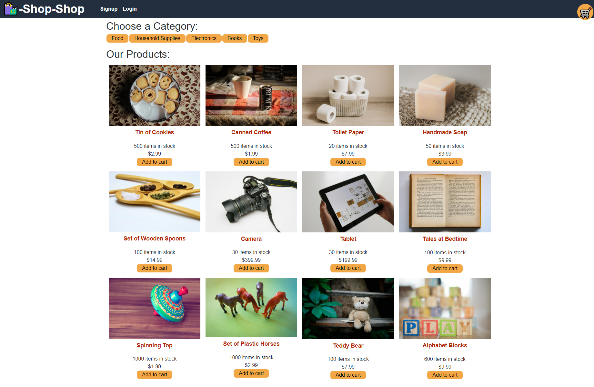

<br>
<p align="center">
   <h2 align="center">Redux Store</h2>
</p>
<br>

## About the project

This is an e-commerce application that uses Redux instead of the Context API as the global state container.

### How to view project

To view this project, simply go to https://mighty-depths-19684.herokuapp.com/to view the finished product.

To see the code for the site:

- Clone the repo

  ```sh
  git clone git@github.com:Zd092718/reduxstore.git
  ```

### Built With

- MongoDB
- Express.js
- React.js
- Node.js
- Redux

### Preview Image



## Contact

Zachary Dowd - zacharyd2796@zohomail.com

Project Link - https://github.com/Zd092718/reduxstore
